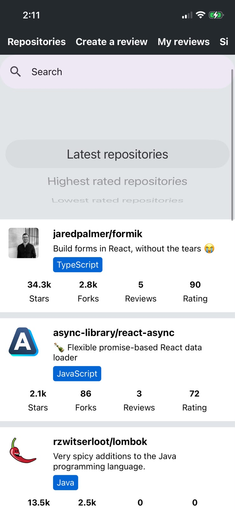
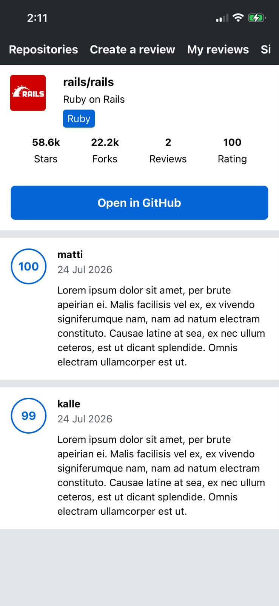

import Callout from '../../components/Callout.astro';

<Callout type="info">
  You can try out the app through the Expo app in your own mobile phone :D
</Callout>

## Features
- Look at repositories and their authors
- Leave comments
- Look at your history of comments
- Filtering repositories by keywords, date, or/and ratings

## Structure
- **Frontend:** React Native. Fetching and mutating the data with GraphQL.
- **Backend:** Provided by the Full Stack Open team.

## Images

